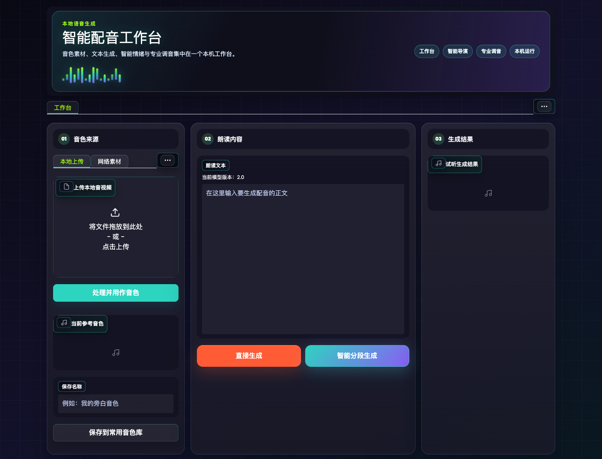

# IndexTTS Studio

基于 [IndexTTS / IndexTTS2](https://github.com/index-tts/index-tts) 改造的本地智能配音工作台。这个分支把原始 Gradio WebUI 重组为更适合真实内容生产的流程：音色来源、朗读文本、智能情绪、专业调音和音频输出集中在一个工作台里。

> 这是一个派生项目，不是 IndexTTS 官方仓库。模型权重、论文、原始能力和许可请以官方仓库及模型许可证为准。



## 主要功能

- 三种同级音色来源：上传本地音视频、解析网络素材、选择常用音色库。
- 本地音视频自动抽取音轨并转换为 24kHz 单声道 WAV，可直接作为参考音色。
- 网络素材支持 `yt-dlp` 解析，适合处理 B 站、抖音、小红书等视频链接。
- 网络素材可指定截取起止时间；未指定时默认截取前 60 秒，单次跨度最多 60 秒。
- 常用音色库可保存已处理好的音色，后续下拉选择即可复用。
- 支持术语表，用于固定特殊词、品牌词、人名等读法。
- 支持大模型或本地规则做文本分段情绪分析，并逐段生成后合并音频。
- 大模型配置支持本地保存，代理可单独开关。
- 重新设计了深色音乐风 UI，并补了多处 Gradio 默认浅底白字的可读性问题。
- 支持反向代理部署，可通过 `--root_path` 挂载到子路径。

## 快速开始

### 1. 准备环境

建议使用 Python 3.10 和 `uv`：

```bash
uv sync --extra webui
```

本地音视频处理和音频合并依赖 `ffmpeg`。macOS 可以这样安装：

```bash
brew install ffmpeg
```

网络素材解析依赖 `yt-dlp`，本项目已写入 `pyproject.toml`：

```bash
uv run python -m yt_dlp --version
```

### 2. 准备模型权重

请按照官方说明下载模型文件到 `checkpoints/`。本仓库不会提交模型权重。

必需文件仍以官方 IndexTTS 文档为准，常见文件包括：

- `checkpoints/config.yaml`
- `checkpoints/bpe.model`
- `checkpoints/gpt.pth`
- `checkpoints/s2mel.pth`
- `checkpoints/wav2vec2bert_stats.pt`

更多信息见 [官方中文说明](docs/README_zh.md)。

### 3. 启动 WebUI

```bash
uv run python webui.py --host 127.0.0.1 --port 7860
```

如果挂在反向代理子路径下，例如 `/indextts/`：

```bash
uv run python webui.py --host 127.0.0.1 --port 7860 --root_path /indextts
```

## 使用流程

1. 在「音色来源」选择一种方式：本地上传、网络素材或常用音色库。
2. 点击处理按钮，把素材转换或设为「当前参考音色」。
3. 在「朗读内容」输入文本。
4. 选择普通生成或智能情绪分段生成。
5. 试听并下载输出音频。

## 智能情绪

智能情绪生成会先把长文本切成小段，再为每段计算情绪向量和强度，逐段调用 IndexTTS2 生成，最后用 `ffmpeg` 合并。

支持两种分析方式：

- 本地规则：不需要 API key，适合离线使用。
- OpenAI 兼容大模型：填写兼容 `/v1/chat/completions` 的接口、模型名和 API key。

代理是独立开关。只有打开代理时，才会把代理地址传给大模型请求。

## 网络素材截取

网络素材默认只处理前 60 秒。也可以填写：

- `截取起点`：支持秒数、`MM:SS`、`HH:MM:SS`
- `截取终点`：同上

为了避免长视频下载过慢或占用过多空间，单次处理跨度限制为 60 秒。

## 私有反向代理部署提示

如果需要在自己的私有网络或受保护的远程入口后使用 Nginx 反向代理，建议为上传和长任务放宽限制：

```nginx
location ^~ /indextts/ {
    client_max_body_size 1024m;
    proxy_request_buffering off;
    proxy_pass http://127.0.0.1:7860/indextts/;
    proxy_http_version 1.1;
    proxy_set_header Upgrade $http_upgrade;
    proxy_set_header Connection "upgrade";
    proxy_set_header Host $host;
    proxy_set_header X-Forwarded-Prefix /indextts;
    proxy_buffering off;
    proxy_read_timeout 3600s;
    proxy_send_timeout 3600s;
}
```

如果使用 SSH 反向隧道，大文件上传会受本机上行速度影响。更推荐用网络素材截取功能，或先把素材剪到 60 秒以内再上传。

## 不应提交的内容

本仓库默认忽略以下内容：

- 模型权重和缓存
- 生成音频
- 用户上传或保存的音色
- 日志
- API key、SSH key、`.env`
- 本机启动脚本和部署私有配置

开源前请确认没有提交私人声音样本、生成音频、密钥或受限模型文件。

## 版本与更新

- 更新记录见 [CHANGELOG.md](CHANGELOG.md)。
- 后续维护方式见 [docs/UPDATE_GUIDE.md](docs/UPDATE_GUIDE.md)。
- 派生项目声明见 [docs/DERIVATIVE_NOTICE.md](docs/DERIVATIVE_NOTICE.md)。

## 许可说明

代码和模型的许可边界请分别遵守原项目文件：

- [LICENSE](LICENSE)
- [LICENSE_ZH.txt](LICENSE_ZH.txt)
- `checkpoints/LICENSE.txt`
- `checkpoints/LICENSE_ZH.txt`

本项目不会重新授权上游模型，也不包含模型权重。商业使用、模型分发和声音素材使用请自行确认具备相应权利。
